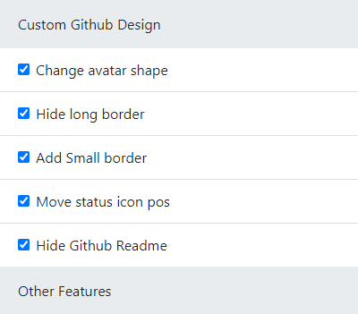

# Github Nostalgia

Chrome extension to modify github profile dom.  
This extension will customize github to look similar to the old design.

### What actually happens

- Circular avatar changes to square avatar with rounded corners

- The Circular avatar has a long rule behind it which is removed

- Hides Github Readme if present

- Adds horizontal rule below tabs.

### All of these can be toggled however there are still some bugs.

## Other features

I have always have had a need to copy a youtube video url with its timestamp. So I have programmed this extension to auto pick the current timestamp you are on and create a url with appropriate parameters.

Note that this extension is still under development any bug reports are welcome

### Preview

## Getting Started

Zip or clone this repository to your local machine.  
To customize dom directly modily file `popup.js`

### Prerequisites

Basic text editor.  
Google Chrome browser.

### Installing

In google chrome enter url `chrome://extensions`
On the top right of the page turn on `developer mode`

## Deployment

To deploy locally drag and drop the `src` folder on to the chrome page or alternatively use the `Load unpacked` button below the app bar and select the `src` folder from your file explorer.

## Versioning

We use [SemVer](http://semver.org/) for versioning. For the versions available, see the [tags on this repository](https://github.com/your/project/tags).

## Authors

- **Alan Dsilva** - _Initial work_ - [alandsilva26](https://github.com/alandsilva26)
<!--
See also the list of [contributors](https://github.com/your/project/contributors) who participated in this project. -->

## License

This project is licensed under the MIT License - see the [LICENSE.md](LICENSE.md) file for details

## Acknowledgments

- https://developer.chrome.com/extensions/getstarted
- https://dev.to/ankitverma31/building-your-first-chrome-extension-a-beginner-s-guide-40a9#about-quick-launcher
- https://medium.com/@divakarvenu/lets-create-a-simple-chrome-extension-to-interact-with-dom-7bed17a16f42
- https://itnext.io/all-youll-ever-need-to-know-about-chrome-extensions-ceede9c28836
- https://thoughtbot.com/blog/how-to-make-a-chrome-extension#:~:text=Load%20your%20extension%20into%20Chrome,your%20extension%20in%20the%20list.
- https://viblo.asia/p/chrome-extension-communicating-between-popup-and-content-script-Qbq5QjQXKD8
- https://medium.com/@divakarvenu/lets-create-a-simple-chrome-extension-to-interact-with-dom-7bed17a16f42
